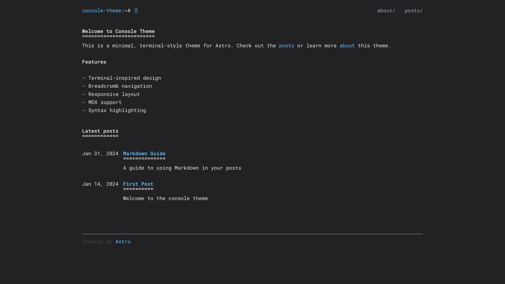
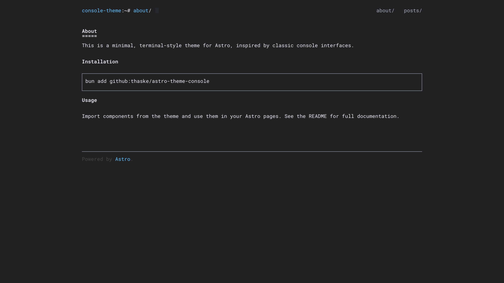
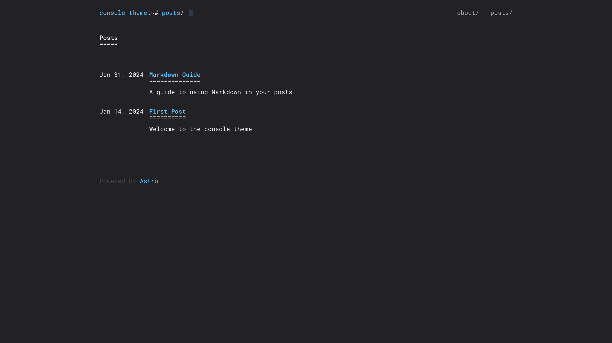
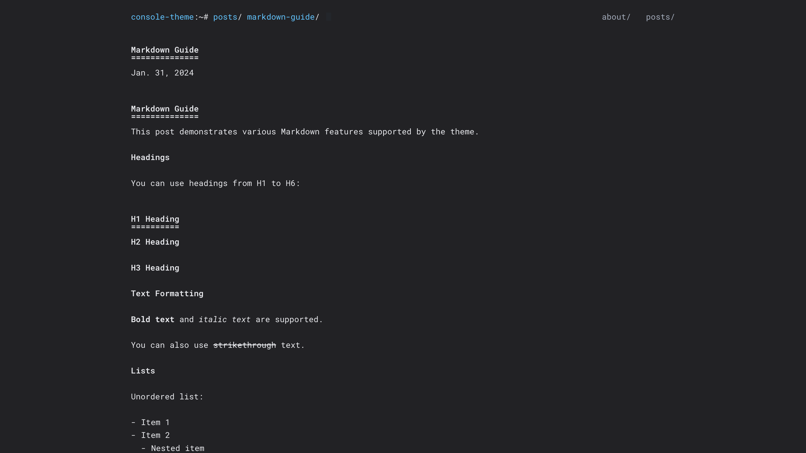

# Astro Theme Console

A minimal, terminal-style theme for Astro. Features a clean, console-inspired design with breadcrumb navigation and responsive layout. Ported from [hugo-theme-console](https://github.com/mrmierzejewski/hugo-theme-console).

## Features

- Terminal-inspired design
- Breadcrumb navigation
- Responsive layout
- Blog post listing with dates
- MDX support
- SEO-friendly meta tags
- Syntax highlighting with Shiki
- Google Analytics support (optional)

## Screenshots

<div style="display: flex; flex-direction: column; gap: 1rem;">
  
  
  
  
</div>

## Installation

```bash
bun add github:thaske/astro-theme-console
```

## Usage

### Using Components

Import components directly from the theme, and centralize shared metadata in a `src/consts.ts` file (just like the example project):

```astro
---
import Layout from "@thaske/astro-theme-console/layouts/Layout.astro";
import Header from "@thaske/astro-theme-console/components/Header.astro";
import Footer from "@thaske/astro-theme-console/components/Footer.astro";
import PostListItem from "@thaske/astro-theme-console/components/PostListItem.astro";
import { ANALYTICS_ID, SITE_DESCRIPTION, SITE_TITLE } from "../consts";
---

<Layout
  title={SITE_TITLE}
  description={SITE_DESCRIPTION}
  analyticsId={ANALYTICS_ID}
>
  <h1>Hello World</h1>
</Layout>
```

Example `src/consts.ts`:

```ts
export const SITE_TITLE = "mysite";
export const SITE_DESCRIPTION = "A minimal, terminal-style blog";
export const ANALYTICS_ID = "G-XXXXXXXXXX";
```

### Configuration

The theme expects the following structure for blog posts:

```
src/
  content/
    blog/
      post-1.md
      post-2.mdx
```

Each blog post should have frontmatter like:

```yaml
---
title: "Post Title"
description: "Post description"
pubDate: 2024-01-01
tags: ["tag1", "tag2"]
draft: false
---
```

### Google Analytics

To enable Google Analytics, pass your tracking ID to the Layout component:

```astro
<Layout analyticsId="G-XXXXXXXXXX">
  <!-- content -->
</Layout>
```

## Example Site

See the `example` directory for a complete working example.

## License

MIT
